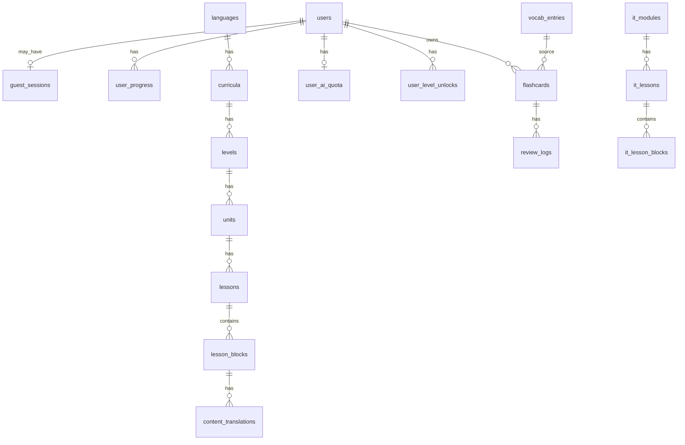

# Database Schema

PostgreSQL. Mọi bảng có `created_at`, `updated_at` (timestamptz) trừ khi ghi chú khác.

**Soft delete:** entity có thể xóa trong tương lai thêm `deleted_at timestamptz NULL`. Chi tiết: [soft-delete.md](./soft-delete.md).

## Sơ đồ quan hệ (tóm tắt)



---

## Core — Users & Auth

### `users`

| Cột | Kiểu | Ghi chú |
|---|---|---|
| id | uuid PK | |
| email | text UNIQUE | nullable nếu chỉ OAuth |
| password_hash | text | nullable |
| display_name | text | |
| locale | text | `vi` \| `en` |
| theme_id | text | default `talkory-classic` — xem DESIGN.md |
| theme_mode | text | `light` \| `dark` |
| role | text | `user` \| `admin` |
| google_sub | text UNIQUE | nullable |
| created_at | timestamptz | |
| updated_at | timestamptz | |
| deleted_at | timestamptz | soft delete tài khoản |

### `guest_sessions`

| Cột | Kiểu | Ghi chú |
|---|---|---|
| id | uuid PK | token gửi qua `X-Guest-Token` |
| lessons_completed | int | đếm bài đã học (max ~2 trước khi bắt đăng ký) |
| merged_to_user_id | uuid FK | nullable — sau khi đăng ký |
| expires_at | timestamptz | |
| created_at | timestamptz | |

---

## Monetization

### `user_ai_quota`

| Cột | Kiểu | Ghi chú |
|---|---|---|
| user_id | uuid PK FK | |
| quota_date | date PK | theo ngày UTC hoặc timezone user |
| base_remaining | int | mặc định 5 |
| bonus_remaining | int | từ rewarded video |
| used_count | int | |

### `user_level_unlocks`

| Cột | Kiểu | Ghi chú |
|---|---|---|
| id | uuid PK | |
| user_id | uuid FK | |
| language_code | text | `ja` \| `zh` |
| level_code | text | `n4`, `hsk2`, ... |
| source | text | `subscription` \| `reward_video` |
| expires_at | timestamptz | null = vĩnh viễn (subscription) |

### `user_subscriptions`

| Cột | Kiểu | Ghi chú |
|---|---|---|
| user_id | uuid PK FK | |
| plan | text | `free` \| `premium` |
| status | text | `active` \| `cancelled` |
| current_period_end | timestamptz | |

### `reward_transactions`

| Cột | Kiểu | Ghi chú |
|---|---|---|
| id | uuid PK | |
| user_id | uuid FK | |
| type | text | `rewarded_video` |
| reward_ai_bonus | int | +5 |
| reward_level_unlock | text | nullable — level mở |
| created_at | timestamptz | |

---

## Curriculum chuẩn (JLPT / HSK)

### `languages`

| Cột | Kiểu | Ghi chú |
|---|---|---|
| code | text PK | `ja`, `zh` |
| name | jsonb | `{"vi":"...", "en":"..."}` |

### `curricula`

| Cột | Kiểu | Ghi chú |
|---|---|---|
| id | uuid PK | |
| language_code | text FK | |
| standard | text | `jlpt` \| `hsk` |
| hsk_version | text | nullable — `2.0` \| `3.0` cho zh |

### `levels`

| Cột | Kiểu | Ghi chú |
|---|---|---|
| id | uuid PK | |
| curriculum_id | uuid FK | |
| code | text | `n5`, `n4`, `hsk1`, `hsk2` |
| sort_order | int | |
| is_free | boolean | N5, HSK1 = true |
| deleted_at | timestamptz | soft delete |

### `units`

| Cột | Kiểu | Ghi chú |
|---|---|---|
| id | uuid PK | |
| level_id | uuid FK | |
| slug | text | |
| sort_order | int | |
| reference_book | text | nullable — `genki_l1` (chỉ metadata) |
| deleted_at | timestamptz | soft delete |

### `lessons`

| Cột | Kiểu | Ghi chú |
|---|---|---|
| id | uuid PK | |
| unit_id | uuid FK | |
| slug | text | |
| lesson_type | text | `vocab` \| `grammar` \| `reading` \| `writing` \| `mixed` |
| sort_order | int | |
| status | text | `draft` \| `published` |
| estimated_minutes | int | |
| deleted_at | timestamptz | soft delete |

### `lesson_blocks`

| Cột | Kiểu | Ghi chú |
|---|---|---|
| id | uuid PK | |
| lesson_id | uuid FK | |
| block_type | text | `text` \| `vocab_list` \| `exercise` \| `reading_passage` \| `writing_prompt` |
| sort_order | int | |
| payload | jsonb | cấu trúc linh hoạt — IDs tham chiếu vocab_entries |
| deleted_at | timestamptz | soft delete |

### `content_translations`

| Cột | Kiểu | Ghi chú |
|---|---|---|
| id | uuid PK | |
| entity_type | text | `lesson_block` \| `vocab_entry` \| `exercise` |
| entity_id | uuid | |
| locale | text | `vi` \| `en` |
| title | text | nullable |
| body | text | markdown/html |
| deleted_at | timestamptz | soft delete khi replace |
| UNIQUE | (entity_type, entity_id, locale) | active only — partial unique index khi cần |

---

## Vocabulary & SRS

### `vocab_entries`

| Cột | Kiểu | Ghi chú |
|---|---|---|
| id | uuid PK | |
| language_code | text | |
| lemma | text | từ gốc |
| reading | text | hiragana / pinyin |
| level_code | text | `n5`, `hsk1` |
| hsk_version | text | nullable |
| jlpt_level | text | nullable |
| metadata | jsonb | radical, stroke_count, source_ref |
| deleted_at | timestamptz | soft delete |

### `flashcards` (FSRS state)

| Cột | Kiểu | Ghi chú |
|---|---|---|
| id | uuid PK | |
| user_id | uuid FK | |
| vocab_entry_id | uuid FK | nullable |
| deck_source | text | `curriculum` \| `it_track` |
| state | smallint | 0=New, 1=Learning, 2=Review, 3=Relearning |
| due_at | timestamptz | |
| stability | float | FSRS |
| difficulty | float | FSRS |
| reps | int | |
| lapses | int | |
| last_review_at | timestamptz | |

### `review_logs`

| Cột | Kiểu | Ghi chú |
|---|---|---|
| id | uuid PK | |
| flashcard_id | uuid FK | |
| rating | smallint | 1=Again, 2=Hard, 3=Good, 4=Easy |
| reviewed_at | timestamptz | |
| scheduled_days | float | |

---

## Writing

### `stroke_data`

| Cột | Kiểu | Ghi chú |
|---|---|---|
| id | uuid PK | |
| character | text | kanji/hanzi |
| language_code | text | |
| svg_path | text | hoặc lưu object storage URL |
| stroke_count | int | |
| radicals | text[] | |
| deleted_at | timestamptz | soft delete |

### `writing_attempts`

| Cột | Kiểu | Ghi chú |
|---|---|---|
| id | uuid PK | |
| user_id | uuid FK | |
| character | text | |
| attempt_data | jsonb | strokes canvas |
| score | float | nullable — phase recognition sau |
| created_at | timestamptz | |

---

## IT Track (riêng biệt)

### `it_modules`

| Cột | Kiểu | Ghi chú |
|---|---|---|
| id | uuid PK | |
| slug | text | `it-vocab-basic` |
| sort_order | int | |
| status | text | `draft` \| `published` |
| deleted_at | timestamptz | soft delete |

### `it_lessons`

| Cột | Kiểu | Ghi chú |
|---|---|---|
| id | uuid PK | |
| module_id | uuid FK | |
| slug | text | |
| target_languages | text[] | `ja`, `zh`, `en` — ngôn ngữ trong bài |
| sort_order | int | |
| status | text | |
| deleted_at | timestamptz | soft delete |

### `it_lesson_blocks`

| Cột | Kiểu | Ghi chú |
|---|---|---|
| id | uuid PK | |
| it_lesson_id | uuid FK | |
| block_type | text | tương tự lesson_blocks |
| payload | jsonb | |
| sort_order | int | |
| deleted_at | timestamptz | soft delete |

---

## Progress & Placement

### `placement_results`

| Cột | Kiểu | Ghi chú |
|---|---|---|
| id | uuid PK | |
| user_id | uuid FK | nullable — guest |
| guest_session_id | uuid FK | nullable |
| language_code | text | |
| recommended_level | text | `n5`, `hsk1`, ... |
| score | float | |
| answers | jsonb | |
| created_at | timestamptz | |

### `user_progress`

| Cột | Kiểu | Ghi chú |
|---|---|---|
| id | uuid PK | |
| user_id | uuid FK | |
| lesson_id | uuid FK | nullable |
| it_lesson_id | uuid FK | nullable |
| status | text | `started` \| `completed` |
| completed_at | timestamptz | |
| UNIQUE | (user_id, lesson_id) | |

### `user_streaks`

| Cột | Kiểu | Ghi chú |
|---|---|---|
| user_id | uuid PK FK | |
| current_streak | int | |
| longest_streak | int | |
| last_activity_date | date | |
| daily_goal_minutes | int | default 15 |

---

## Admin / Import

### `import_jobs`

| Cột | Kiểu | Ghi chú |
|---|---|---|
| id | uuid PK | |
| source | text | `jmdict`, `hsk3`, `kanjivg` |
| status | text | `pending` \| `running` \| `done` \| `failed` |
| stats | jsonb | |
| created_by | uuid FK users | |
| created_at | timestamptz | |

### `ai_content_drafts`

| Cột | Kiểu | Ghi chú |
|---|---|---|
| id | uuid PK | |
| entity_type | text | |
| entity_id | uuid | |
| locale | text | |
| draft_body | text | AI soạn — chờ admin duyệt |
| status | text | `pending` \| `approved` \| `rejected` |
| reviewed_by | uuid FK | |
| deleted_at | timestamptz | soft delete |

### `ai_usage_logs`

Append-only — audit AI. Xem [backend/logging.md](../backend/logging.md).

---

## Lexicon (phase sau — dictionary free)

### `dictionary_entries`

| Cột | Kiểu | Ghi chú |
|---|---|---|
| id | uuid PK | |
| language_code | text | `ja` \| `zh` |
| headword | text | |
| reading | text | |
| definitions | jsonb | |
| source | text | `jmdict`, `cc-cedict` |
| external_id | text | |
| created_at | timestamptz | |
| updated_at | timestamptz | |
| deleted_at | timestamptz | soft delete |

### `dictionary_senses`

| Cột | Kiểu | Ghi chú |
|---|---|---|
| id | uuid PK | |
| entry_id | uuid FK | |
| sense_order | int | |
| gloss_vi | text | |
| gloss_en | text | |
| pos | text | |
| examples | jsonb | |

### `lookup_cache`

| Cột | Kiểu | Ghi chú |
|---|---|---|
| cache_key | text PK | hash(lang+query+mode) |
| result | jsonb | |
| expires_at | timestamptz | |

Chi tiết: [features/dictionary-translation.md](../features/dictionary-translation.md)

---

## Indexes đề xuất

```sql
CREATE INDEX idx_lessons_unit_status ON lessons(unit_id, status, sort_order);
CREATE INDEX idx_flashcards_user_due ON flashcards(user_id, due_at) WHERE due_at IS NOT NULL;
CREATE INDEX idx_user_progress_user ON user_progress(user_id, status);
CREATE INDEX idx_content_translations_lookup ON content_translations(entity_type, entity_id, locale);
```
