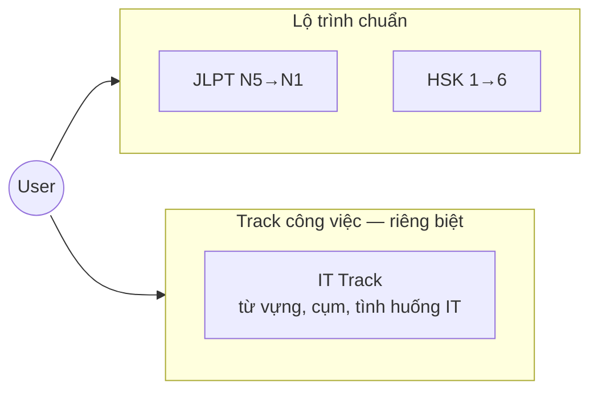

# Overview

## Sản phẩm

**Talkory** — ứng dụng học tiếng Nhật và tiếng Trung cho người tự học (ưu tiên người Việt), có lộ trình chuẩn JLPT/HSK, module học theo công việc IT riêng biệt, và AI tutor hỗ trợ giải thích/sửa câu.

## Đối tượng

- Người tự học, cần lộ trình bài bản như học sinh/sinh viên
- Có nhu cầu học theo mục tiêu công việc (IT)
- Theo dõi tiến độ học qua dashboard

## Điểm khác biệt

| # | Khác biệt |
|---|---|
| 1 | Lộ trình chuẩn JLPT/HSK — không bịa chế, map theo sách/syllabus tham chiếu |
| 2 | Tối ưu người Việt — giải thích theo ngôn ngữ UI (vi/en) |
| 3 | Học viết Hán/Kanji mạnh — stroke order, canvas, radical, typing |
| 4 | AI tutor giải thích sâu — không chỉ chat surface-level |
| 5 | Track IT độc lập — không gắn vào unit bài học chuẩn |

## Nguyên tắc dữ liệu

- **Mọi nội dung học nằm trong PostgreSQL** — UI không hardcode bài học
- Admin CMS sửa/import nội dung mà không cần deploy lại frontend
- Nội dung giải thích đa ngôn ngữ (`vi`, `en`) theo locale UI người dùng

## Stack kỹ thuật

| Layer | Công nghệ |
|---|---|
| Frontend | Vue 3 + Nuxt 4, i18n (vi, en) |
| Backend | Go Gin — **chỉ pgx, SQL tự viết** (không GORM/ORM) |
| Database | PostgreSQL |
| AI | Gemini + OpenAI-compatible (provider abstraction) |
| Auth | Email/password, Google OAuth, Guest mode |
| Hosting | Cloud (quyết định sau) |

## Kiến trúc v1

```
Nuxt 4 (Web)  ──REST/JSON──▶  Go Gin API  ──pgx──▶  PostgreSQL
                                    │
                                    ├──▶ Gemini API
                                    └──▶ OpenAI-compatible API
```

- **Không dùng Node Express ở v1** — Go Gin đủ cho REST, AI proxy, SRS, CMS API
- **Offline**: chưa implement; schema thiết kế có `updated_at` để hỗ trợ sync sau

## Hai luồng học chính



Hai luồng **không share unit/lesson** — chỉ share infrastructure (auth, SRS engine, AI, dashboard).

## Module v1

| Module | v1 |
|---|---|
| Placement test | ✓ |
| Lộ trình JLPT (JP) | ✓ |
| Lộ trình HSK (CN) | ✓ |
| Từ vựng + SRS (FSRS) | ✓ |
| Ngữ pháp + bài tập | ✓ |
| Đọc hiểu | ✓ |
| Học viết (stroke, canvas, radical, typing) | ✓ — free |
| Dashboard, daily goal, streak | ✓ |
| AI tutor | ✓ — quota free 5/ngày |
| Track IT | ✓ — module riêng |
| Admin CMS | ✓ |
| Listening / Speaking | ✗ — phase sau |
| Dictionary / Translate | ✗ — phase sau, **luôn free** |
| Mobile native | ✗ — web trước |
| Offline | ✗ — rào sẵn |
