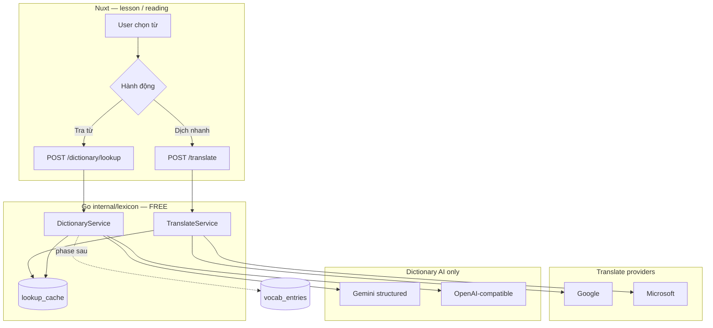

# Tham chiếu logic: Read Frog → Talkory Lexicon

> Clone: `temp/read-frog`  
> **Phạm vi tham chiếu của bạn:** logic **tra từ vựng (AI)** + **dịch từ/câu (Google & Microsoft)** — không port UI extension.  
> License GPL-3.0: **viết lại** bằng Go/Vue, không copy file.

---

## Hai luồng tách biệt (quan trọng)

Read Frog tách rõ **2 tính năng** — Talkory cũng nên tách route/service:

| | **Dịch (Translate)** | **Tra từ điển (Dictionary AI)** |
|---|---|---|
| Mục đích | Đổi ngôn ngữ câu/đoạn đã chọn | Giải thích từ trong ngữ cảnh (nghĩa, reading, POS…) |
| Provider chính | `google-translate`, `microsoft-translate` (free, không LLM) | LLM (Gemini/OpenAI) — **structured JSON** |
| Input | `text` + `from` + `to` | `selection` + `paragraphs` (ngữ cảnh) + `targetLanguage` |
| Output | Chuỗi dịch | Object: Term, Phonetic, Definition, … |
| Talkory API | `POST /api/v1/translate` | `GET/POST /api/v1/dictionary/lookup` |
| Quota | **Free** — không dùng `user_ai_quota` | **Free** — service `lexicon` riêng (có thể rate limit nhẹ) |

> **AI Tutor** (`/api/v1/ai/*`) là luồng thứ 3 — grammar/exercise, có quota freemium. **Không** trộn với 2 luồng trên.

---

## Luồng 1 — Dịch từ vựng / câu (Google & Microsoft)

### Read Frog — logic

```
User chọn text
  → prepareTranslationText(text)
  → hash(text + lang + provider + context…)  // cache
  → enqueueTranslateRequest (background queue)
  → executeTranslate()
       ├─ provider === "google-translate"  → googleTranslate()
       ├─ provider === "microsoft-translate" → microsoftTranslate()
       ├─ deepl / deeplx                     → (API key)
       └─ LLM provider                       → aiTranslate()  // không dùng cho free tier mặc định
  → normalizeTranslationOutput()
  → lưu translationCache (Dexie)
  → trả chuỗi dịch
```

**File:** `execute-translate.ts`, `translate-text.ts`, `translation-queues.ts`

### Google provider

- **Endpoint:** `POST https://translate-pa.googleapis.com/v1/translateHtml`
- **Body:** `[[[sourceText], fromLang, toLang], "wt_lib"]`
- **Header:** `X-Goog-API-Key` (public key trong extension — Talkory nên dùng **API key riêng** hoặc Cloud Translation API chính thức)
- **Lang:** ISO 639-1 (`ja`, `zh`, `vi`, `en`…); `auto` cho nguồn
- **Response:** `result[0][0]` — chuỗi dịch

### Microsoft provider

- **Token:** `GET https://edge.microsoft.com/translate/auth` → bearer text
- **Endpoint:** `POST https://api-edge.cognitive.microsofttranslator.com/translate?from=&to=&api-version=3.0`
- **Body:** `[{ "Text": "..." }, ...]` — hỗ trợ batch
- **Header:** `Ocp-Apim-Subscription-Key` + `Authorization: Bearer {token}`
- **Response:** `result[i].translations[0].text`

### Talkory — đề xuất port (Go)

```go
// internal/lexicon/translate_provider.go

type TranslateProvider interface {
    Translate(ctx context.Context, text, from, to string) (string, error)
}

type GoogleTranslateProvider struct { /* API key từ env */ }
type MicrosoftTranslateProvider struct { /* token refresh cache */ }

// TranslateService — chọn provider theo config, fallback nếu lỗi
func (s *TranslateService) Translate(ctx context.Context, req TranslateRequest) (string, error) {
    key := cacheKey(req)
    if cached := s.repo.GetCache(key); cached != nil { return cached, nil }
    // primary: GOOGLE | MICROSOFT từ config
    // optional: fallback provider
    // không trừ user_ai_quota
}
```

**Env gợi ý:** `LEXICON_TRANSLATE_PROVIDER=google|microsoft`, `GOOGLE_TRANSLATE_API_KEY`, fallback `microsoft`.

**Lang map Talkory:** `ja`, `zh`, `vi`, `en` ↔ ISO 639-1 (giống Read Frog `ISO6393_TO_6391` trong `@read-frog/definitions` — tham khảo mapping).

---

## Luồng 2 — Tra từ vựng bằng AI (Dictionary)

### Read Frog — logic

```
User chọn từ trong trang
  → lấy selection + paragraphs (đoạn xung quanh, truncate)
  → optional: webPageContext (title, content) — Talkory thay bằng lesson_id / block context
  → buildCustomActionExecutionPlan()
       promptTokens: { selection, paragraphs, targetLanguage, webTitle, webContent }
  → buildSelectionToolbarCustomActionSystemPrompt(systemPrompt + outputSchema)
  → replacePromptTokens(prompt)  // {{selection}}, {{paragraphs}}, {{targetLanguage}}
  → streamBackgroundStructuredObject (AI SDK)
       instructions = systemPrompt + JSON contract
       prompt = user input
       outputSchema = [Term, Phonetic, POS, Definition, Paragraphs, ParagraphsTranslation, Difficulty]
  → parse JSON → hiển thị popover
```

**File chính:**
- `custom-action-templates.ts` — schema fields
- `locales/en.yml` — `dictionary.systemPrompt` + `dictionary.prompt`
- `custom-action-prompt.ts` — token replace + JSON contract
- `use-custom-action-execution.ts` — orchestration

### Prompt structure (adapt cho Talkory)

**System prompt** (tóm tắt từ Read Frog):
1. Bạn là dictionary assistant cho người học ngôn ngữ
2. Cho `term` + `paragraphs` → entry khớp ngữ cảnh
3. Normalize term về dạng gốc (lemma)
4. Phonetic: pinyin (ZH), romaji/kana (JA), IPA (EN)
5. Definition bằng `targetLanguage` (vi/en theo UI user)
6. `Paragraphs` giữ nguyên; thêm `ParagraphsTranslation`
7. `Difficulty`: Talkory dùng **JLPT/HSK** thay CEFR

**User prompt template:**
```text
## Input
Selection: {{selection}}
Paragraphs: {{paragraphs}}
Target language: {{targetLanguage}}
```

**Output JSON (bắt buộc):**
```json
{
  "term": "食べる",
  "phonetic": "たべる",
  "partOfSpeech": "verb",
  "definition": "ăn",
  "paragraphs": "毎日ご飯を食べる。",
  "paragraphsTranslation": "Mỗi ngày tôi ăn cơm.",
  "difficulty": "N5"
}
```

### Talkory — đề xuất port (Go)

```go
// internal/lexicon/dictionary_ai.go

type DictionaryAIRequest struct {
    Selection      string
    Paragraphs     string // ngữ cảnh từ lesson block
    SourceLang     string // ja | zh
    TargetLocale   string // vi | en
    LessonID       *uuid.UUID // optional context
}

// 1. Check lookup_cache (hash selection+paragraphs+locale)
// 2. Optional: local hit từ dictionary_entries / vocab_entries → merge hoặc skip AI
// 3. Gọi Gemini/OpenAI structured output (JSON schema)
// 4. Lưu cache, trả về — KHÔNG user_ai_quota
```

**Prompt files:** `internal/lexicon/prompts/dictionary_vi.tmpl` — viết lại từ ý `en.yml`, không copy nguyên văn.

**Tham khảo thêm:** `word-explain.ts` — template word vs sentence (nếu user chọn cả câu).

---

## Sơ đồ tổng Talkory



---

## Không tham chiếu / phase sau

| Read Frog | Talkory |
|---|---|
| Extension content script | Nuxt in-app popover |
| Dexie cache | PostgreSQL `lookup_cache` |
| 20+ LLM providers | Gemini + OpenAI-compatible |
| DeepL | Optional sau |
| Page translation toàn trang | Không cần v1 |
| YouTube subtitles | Phase listening |

---

## Quyết định đã chốt (lexicon v1)

| # | Quyết định |
|---|---|
| 1 | **Tra từ:** chỉ **AI** (chưa có DB từ điển) — local DB phase sau |
| 2 | **Dịch:** Google primary → **fallback Microsoft** khi lỗi |
| 3 | **UI bài học:** **một popover, 2 tab** — tab mặc định theo độ dài selection |

### Đánh giá fallback Google + Microsoft

**Khả thi — nên làm.** Gọi từ Go server (proxy), cache `lookup_cache`, rate limit.

| Rủi ro | Ghi chú |
|---|---|
| Google public key (Read Frog) | Production nên API key riêng hoặc Cloud Translation sau |
| Microsoft edge token | Endpoint không chính thức — có thể đổi; fallback vẫn đáng có |

```text
try Google (timeout ~5s) → cache
  fail → try Microsoft → cache
    fail → 503 translate_unavailable
```

### UX popover

| Tab | Mặc định khi | Nội dung |
|---|---|---|
| **Tra từ** | Selection ngắn (≤ ~15 ký tự, 1 từ/kanji) | AI dictionary |
| **Dịch** | Câu / đoạn dài | Google/Microsoft |

User đổi tab thủ công. Component: `LexiconPopover.vue`, lazy load API theo tab.

---

## File Read Frog — chỉ mục logic

| Luồng | File |
|---|---|
| Router dịch | `src/utils/host/translate/execute-translate.ts` |
| Google | `src/utils/host/translate/api/google.ts` |
| Microsoft | `src/utils/host/translate/api/microsoft.ts` |
| Cache + queue dịch | `src/utils/host/translate/translate-text.ts`, `src/entrypoints/background/translation-queues.ts` |
| Dictionary schema | `src/utils/constants/custom-action-templates.ts` |
| Dictionary prompt | `src/locales/en.yml` (dictionary.*), `src/utils/prompts/word-explain.ts` |
| Dictionary orchestration | `src/entrypoints/selection.content/selection-toolbar/custom-action-button/use-custom-action-execution.ts` |
| Prompt tokens | `src/entrypoints/selection.content/selection-toolbar/custom-action-prompt.ts` |

## Liên kết

- [dictionary-translation.md](../features/dictionary-translation.md)
- [backend/api/S13-lexicon.md](../backend/api/S13-lexicon.md)
